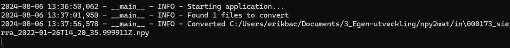

# npy2mat

A simple GUI-based tool for converting NumPy `.npy` files to MATLAB `.mat` files using Python's PySimpleGUI, NumPy, and SciPy libraries.

## Features

- **User-Friendly Interface**: Select directories for input `.npy` files and output `.mat` files with ease.
- **Batch Conversion**: Convert all `.npy` files in a directory to `.mat` format in one go.
- **Logging**: Keep track of conversion processes and errors with detailed logging.
- **Contact Info**: Easily accessible information to contact the creator for support or inquiries.

## Requirements

You can install the required packages using the following command:

```bash
pip install -r requirements.txt
```

## Usage

### GUI

Download the GUI executable file here: https://nppd.se/npy2mat/npy2mat.exe

* Browse and select the directory containing the `.npy` files.
* Browse and select the target directory to save the converted `.mat` files.
* Click the **Convert** button to start the conversion process.
* Click the **Cancel** button to close the application.
* Click the **Contact Info** button to view the creator's contact information.

When the conversion is completed, the console will look like something like this:



### Commande Line Interface

1. Clone the repository:
```bash
git clone https://github.com/ekvll/npy2mat.git
cd npy2mat
```

2. Run the application:
```bash
python npy2mat.py
```


## Contribute

Contributions are welcome! If you would like to contribute to this project, please follow these steps:

1. **Fork the Repository**:
   
   Click the "Fork" button at the top right corner of this repository to create a copy of the repository in your GitHub account.

2. **Clone Your Fork**:
   
   Clone your forked repository to your local machine:
   ```bash
   git clone https://github.com/ekvll/npy2mat.git
   cd npy2mat
   ```

3. **Create a Branch**:
   
   Create a new branch for your feature or bug fix:
   ```bash
   git checkout -b feature-or-bugfix-name
   ```

4. **Make Your Changes**:
   
   Make the necessary changes to the codebase.

5. **Commit Your Changes**:
   
   Commit your changes with a descriptive commit message:
   ```bash
   git add .
   git commit -m "Description of the changes made"
   ```

6. **Push to Your Fork**:
   
   Push your changes to your forked repository:
   ```bash
   git push origin feature-or-bugfix-name
   ```

7. **Create a Pull Request**:
   
   Go to the original repository on GitHub and click the "New Pull Request" button. Select your branch from the "compare" dropdown and submit the pull request.

## Contact

For any questions or support, please contact:

**Erik Lindvall**

Email: erik.lindvall@ri.se 